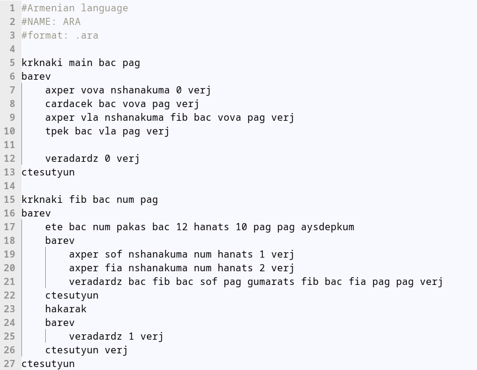
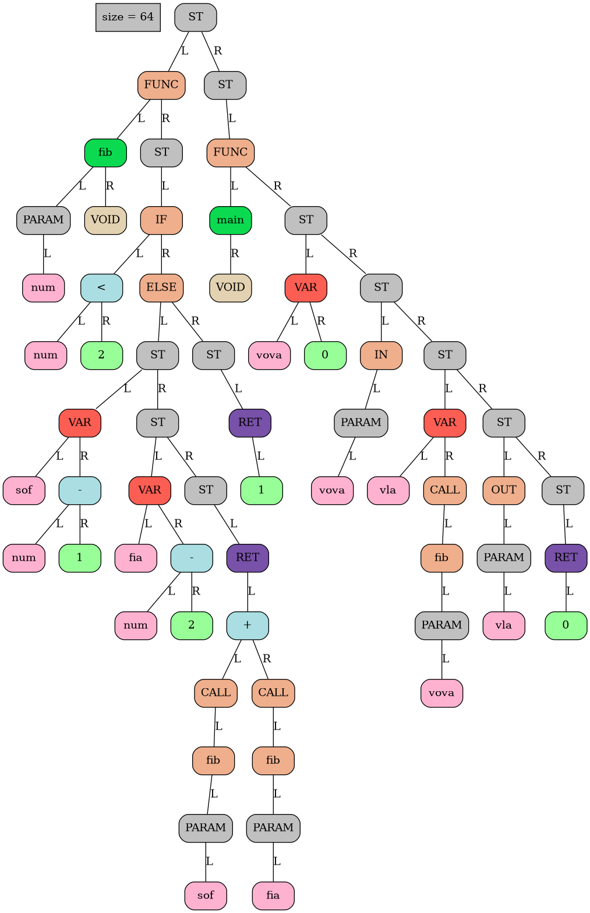
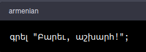

# Язык программирования
## Описание проекта
Данный проект представляет собой разработку армянского языка программирования и компилятора для него. Язык программирования создан с уникальной особенностью, которая заключается в использовании армянских ключевых слов. Это придает языку красивый и колоритный характер, отражающий армянскую культуру и народ.
## Основные компоненты проекта
### Фронтенд (frontend)
Объясним сначала понятие абстрактное синтаксическое дерево (AST):

AST представляет собой дерево, где каждый узел соответствует определенному элементу программы (например, оператору, выражению или объявлению переменной), а дочерние узлы представляют его подэлементы. AST обычно используется в компиляторах для анализа и преобразования программы перед ее исполнением.

Фронтенд отвечает за создание Абстрактного Синтаксического Дерева (AST) на основе исходного кода, написанного на армянском языке программирования. Фронтенд использует метод рекурсивного спуска для синтаксического анализа и формирует структуру данных, отражающую семантику кода.

Пример написанной на моем языке программы, высчитывающий n-ое число Фибоначчи, где n - введенное пользователем число:


### Согласование структуры AST
Структура AST была разработана коллективно командой учеников с целью установления стандарта, который будет поддерживаться всеми. Это обеспечивает возможность перевода программы с одного языка на другой с использованием общей структуры AST.
Примечание: Подробнее о структуре используемого мною AST можно прочитать в [данном репозитории](https://github.com/dodokek/LanguageStandart)

Пример AST программы, высчитывающий n-ое число Фибоначчи, где n - введенное пользователем число:



### Мидлэнд (middleend)
Отвечает за оптимизацию кода, включая свертку констант и удаление лишнего кода. Мидлэнд анализирует AST, полученное от фронтенда, и применяет различные техники оптимизации для улучшения эффективности и производительности кода.

### Бэкенд (backend)
Отвечает за генерацию байт-кода для моего собственного [виртуального процессора](https://github.com/mr-gukas/MyCPU). Бэкенд принимает оптимизированное AST от мидлэнда и преобразует его в инструкции, понятные виртуальному процессору. Затем байт-код выполняется на виртуальном процессоре, реализующем исполнение программы.

### Будущие планы
В будущем я планирую продолжать развивать армянский язык программирования, добавлять новые возможности и улучшать его производительность. И, конечно же, планируется полный переход на армянский язык, подразумевающий написание программ армянскими буквами, а не английскими. Когда-нибудь мир увидит ```Hello, world!```, но немного в другом виде...



